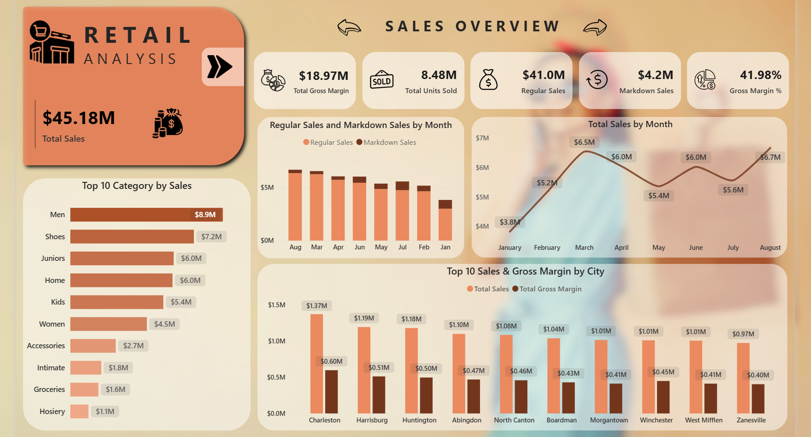

# Retail Sales Analysis — 2014

## Overview
End-to-end data analysis and machine learning project on a retail sales dataset 
containing 923,371 transactions across 100 store locations and 105,916 products.

## Key Findings
- **Total Revenue:** $45.18M | **Gross Margin:** $18.97M | **Margin %:** 41.98%
- **Seasonality:** Sales peak in August ($6.67M) and dip in January ($3.82M)
- **Star Product:** Item 17791 generates $98,697 — 2.5x more than the next best item
- **Pareto:** 23.1% of products drive 80% of revenue — 81K SKUs contribute almost nothing
- **Store Clusters:** 3 distinct store types identified — High Volume, Weak, and Efficient
- **Forecast:** Sales projected to grow toward $7.9M/month by Feb 2015
- **Regression:** Linear model achieves R² of 0.9969 predicting store-level revenue

## Tech Stack
- Python 3.10 — Pandas, Matplotlib, Seaborn, Plotly, Prophet, Scikit-learn
- Power BI — 6-page interactive dashboard
- Jupyter Notebook
- Git / GitHub

## Project Structure
- `Retail_Sales_Analysis.ipynb` — full analysis notebook
- `Retail_Analysis_Project.xlsx` — raw dataset
- `dashboard_screenshots/` — Power BI dashboard previews

## Analysis Sections
1. Data Loading & Exploration
2. Feature Engineering
3. Exploratory Data Analysis
4. Key Business Insights
5. Pareto Analysis
6. Interactive Visualizations (Plotly)
7. Sales Forecasting (Prophet)
8. K-Means Store Clustering
9. Sales Regression Model

## Dashboard Preview

[View Full Interactive Dashboard](https://app.fabric.microsoft.com/links/bK5vnopljF?ctid=56c1d497-700b-49cf-8f8d-3dd6b20d522f&pbi_source=linkShare)
